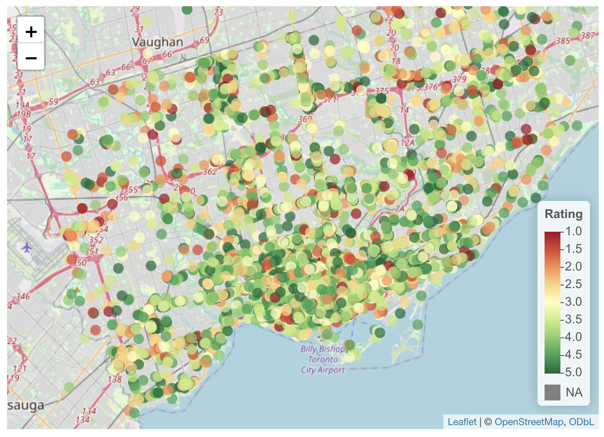
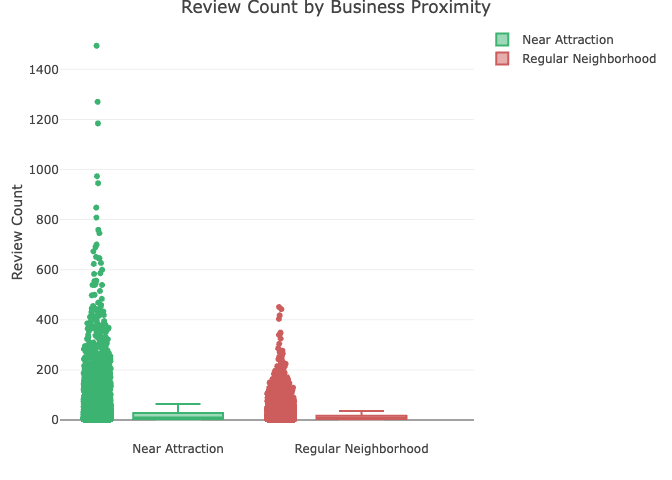
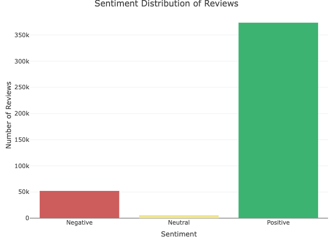
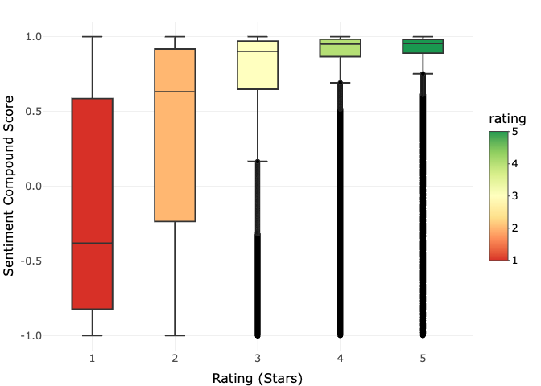
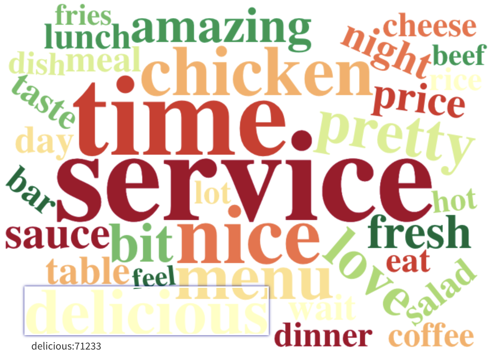

# A. Introduction

Tourism plays a major role in shaping the economy of Toronto, Canada’s largest city and a popular tourist destination. Understanding how proximity to attractions influences business success can offer valuable insights for business owners, urban planners, and tourism boards. In this project, we explore the relationship between **Toronto Yelp businesses**, their **reviews**, and their proximity to **tourist attractions**, by interactive exploratory data analysis and producing predictive modelling using machine learning models. This study builds upon the initial exploratory and sentiment analysis of Toronto businesses by developing predictive models to understand what factors influence Yelp business ratings. After exploring how tourist attractions affect nearby businesses and examining sentiment patterns across reviews, we now aim to determine whether these factors can predict business performance.

The analysis leverages three datasets: Toronto’s Places of Interest and Attractions from the Toronto Open Data portal, and Yelp Business and Review datasets from Kaggle (sourced from the Yelp Open Dataset, year 2018), filtered to include only Toronto-based businesses and their reviews. By leveraging initial sentiment analysis results and using machine learning techniques, we explore whether a combination of review sentiment, user engagement metrics, and proximity to tourist attractions can effectively forecast how customers rate businesses. The models developed in this analysis could provide valuable insights for business owners considering location strategies, current businesses looking to improve their ratings, and city planners interested in maximizing the tourism-business relationship across Toronto. 

# B. Methods

## B.1. Data Preprocessing and Initial Analysis

An extensive data preprocessing and initial analysis (including sentiment analysis) was done initially by mid-project, and the full report can be viewed [here](https://github.com/naurataufiq/business-analysis/blob/main/business_analysis.pdf).

To summarize the initial preprocessing, datasets were sourced from both the Toronto Open Data API and the Yelp Open Data subsets from Kaggle. The Toronto dataset, accessed via the CKAN interface, included information on attractions such as names, categories, coordinates, contact details, and descriptions. Yelp provided two key datasets: one on businesses containing names, locations, ratings, categories, and review counts, and another on user-generated reviews with review texts, dates, ratings, and user/business identifiers.

The steps involved cleaning and merging these datasets. Duplicate entries were removed from all three sources to avoid inflating the final cleaned datasets. For attractions, duplicates were identified by name; for businesses, by name, address, neighborhood, and postal code (to account for chains); and for reviews, by comparing user IDs, business IDs, review texts, and ratings. The Yelp Business dataset had the most duplicate entries, likely due to updates in business information. We retained the most recent entries by selecting rows with the highest review count or open status. After filtering only Toronto businesses and removing entries with missing coordinates, we merged them with the attractions dataset by identifying the nearest attraction to each business using a KDTree spatial index. Each business was then linked to its closest attraction along with the distance between them. Lastly, we merged the cleaned Yelp reviews with this Toronto business data to enrich the context for each review. 

Data wrangling and exploratory analysis were primarily conducted using Pandas. We validated geographic coordinates to ensure all businesses were within Toronto’s bounds (latitude: 43.5–43.9, longitude: –79.6 to –79.2) and corrected minor inconsistencies such as erroneous state codes (e.g., changing 'AB' to 'ON' for businesses clearly located in Toronto). Additional review text cleaning was also done to eliminate redundant or copied content. While exact duplicate reviews were not found, some review texts appeared multiple times across different users or businesses. To address this, we retained only the earliest version of each duplicate text and removed instances where a review was shared under multiple user IDs, unless the businesses being reviewed were different.

All of these results in the final two datasets; **cleaned business dataset and reviews dataset,** each containing 17,060 and 430,906 observations respectively. This extensive preprocessing ensured that the final datasets accurately represented Toronto businesses, their closest attractions, and authentic customer feedback. An initial exploratory data analysis was also conducted, as well as **sentiment analysis** using VADER that computes a compound_score, a single numerical value summarizing the overall sentiment of the review on a scale from –1 (extremely negative) to +1 (extremely positive). We also assigned each review a categorical sentiment label: positive, neutral, or negative—based on this score. Thus, in addition to the cleaned business dataset and reviews dataset, we also created a **merged dataset that contained the sentiment analysis result**, containing 429,077 observations. These final datasets are the one that we are using here, setting the foundation for the analysis and modeling to follow.

## B.2. Exploratory Data Analysis (Extended)

The extended exploratory data analysis employed a comprehensive suite of visualization techniques to uncover patterns and relationships within the Toronto business ecosystem. The analysis was conducted using R's tidyverse packages along with specialized visualization libraries to create interactive and informative data explorations.

For geospatial analysis, we developed an interactive Leaflet map that visualized all Toronto businesses color-coded by their average ratings. The map used a red-yellow-green (RdYlGn) color gradient to represent ratings from 1 to 5 stars, with pop-up markers that displayed detailed business information including name, category, rating, and nearest attraction details. This spatial visualization allowed us to observe potential geographic clustering of high and low-rated businesses in relation to tourist attractions.

To understand how proximity to attractions might influence business visibility, we created comparative boxplots using Plotly. These interactive visualizations compared review counts between businesses located within 1 kilometer of an attraction versus those in regular neighborhoods. The plots incorporated scattered points to show individual business distributions while maintaining traditional boxplot statistics, with hover functionality that revealed specific business names and exact review counts. This approach provided insights into whether businesses near attractions have better visibility and engagement.

Sentiment analysis formed a crucial component of our EDA. We implemented a three-way sentiment classification system (positive/neutral/negative) based on VADER compound scores and visualized the distribution across all reviews using interactive bar charts. These charts included both raw counts and percentage calculations, with hover-text functionality that allowed users to explore the precise breakdown of sentiment across the dataset. The visualizations revealed the overwhelming predominance of positive sentiment in Toronto business reviews.

For textual analysis, we developed positive-sentiment (since it is the dominant on reviews sentiment for Toronto businesses) word clouds using the tidytext package for tokenization and processing. The analysis incorporated custom stopword removal to filter out common but uninformative terms, including location-specific words like "Toronto." The word clouds were limited to the top 50 most frequent terms to maintain clarity and interpretability. This approach helped identify key themes and descriptors for positive-labeled reviews.

The technical implementation leveraged several specialized R packages: leaflet for geospatial visualization, plotly for interactive charts, wordcloud2 for textual analysis, and tidytext for natural language processing tasks. All visualizations were designed with interactive elements to enable deeper exploration of the underlying data patterns while maintaining clean default views. For spatial calculations, we used the WGS84 coordinate reference system (latitude/longitude) to ensure accuracy in our location-based analyses. This multifaceted EDA approach provided both macro-level pattern identification through aggregate visualizations and micro-level investigation capabilities via interactive tooltips across all key dataset dimensions.

## B.3. Predictive Modelling

The predictive modeling approach employed two distinct classification frameworks to analyze Yelp business ratings. First, a multi-class classification system categorized ratings into three groups: low (< 3), medium (= 3), and high (> 3). Second, a binary classification system simplified this into low (< 3) and high (> or = 3) categories by excluding the ambiguous medium ratings. This dual approach allowed for comparison of model performance across different classification complexities.

Two advanced machine learning algorithms were implemented for each classification task:

### XGBoost
The XGBoost algorithm was selected for its superior performance in handling structured data and its ability to capture complex feature interactions through gradient-boosted decision trees. This approach was particularly suitable for our dataset, as it efficiently manages mixed data types (numerical and categorical) while minimizing overfitting through regularization. We implemented XGBoost with 150 boosting rounds (nrounds), a maximum tree depth of 6, and a conservative learning rate (eta = 0.1) to ensure stable convergence. Feature subsampling (80%) and column subsampling by tree (80%) were applied to enhance model robustness. The algorithm's native support for multi-class classification ("multi:softmax" objective) made it ideal for comparing both our multi-class and binary rating predictions. XGBoost's built-in feature importance metrics also allowed us to identify key predictors—particularly useful given our hypothesis about sentiment and location features driving rating patterns.

### Random Forest
Random Forest was chosen as a comparative benchmark due to its inherent resistance to overfitting and ability to handle non-linear relationships without extensive hyperparameter tuning. By constructing 200 decision trees on random subsets of data and features, the model naturally accounts for variability in our dataset while maintaining interpretability. Unlike XGBoost's sequential error correction, Random Forest's parallelized bagging approach provided a different perspective on feature importance, helping validate the consistency of key predictors like compound_score and nearest_attraction_category. We maintained default parameters (mtry = sqrt(p) for classification) to leverage the algorithm's "out-of-the-box" reliability, though this came at the cost of XGBoost's fine-grained optimization capabilities. The implementation served as a robust baseline to confirm whether performance gains from XGBoost justified its additional complexity, especially for our binary classification task where both algorithms achieved similar accuracy.

The technical implementation utilized R's caret package for streamlined model training and evaluation. The dataset was split into 80% training and 20% testing sets using stratified sampling (random seed = 42) to maintain class distribution. Categorical features underwent one-hot encoding via dummyVars() to ensure proper numerical representation. Key predictive features included sentiment analysis outputs (both categorical labels and continuous compound scores), user engagement metrics (useful, funny, cool votes) and business location context (nearest attraction category).

Model performance was evaluated using classification accuracy and confusion matrices, with particular attention to the training-test accuracy gap as an indicator of overfitting. Feature importance analysis was conducted for XGBoost models using gain metrics, revealing the relative contribution of each predictor. The implementation leveraged xgboost and randomForest packages, with supplementary visualization through ggplot2 for result interpretation.

# C. Results

## C.1. Exploratory Data Analysis 

As mentioned above, most exploratory data analysis was already done in the mid-project stage. The full report can be viewed here. This time, we will analyze the new plots that are interactive, or the existing ones that we upgraded with interaction for engagement and information addition. These can all be seen in this [EDA webpage](eda.html) and we will present the results in the same order. 

The interactive map of businesses in Toronto (Fig. 1) revealed that businesses are relatively evenly distributed across Toronto, with no clear geographic concentration of high or low-rated establishments. 

{ width=50% }

However, there are several things worth noticing here, like how the business category near some tourist attractions would mostly consist of food and beverage. We can also see that most businesses in Toronto have decent to really good rating (most are green colored). There's also specific areas (though not much nor significant, as we already mentioned that distribution is generally even) that have a lot of low-rated businesses, for example around Dixon Road and Highway 27 near the Pearson airport. 

{ width=50% } 

{ width=50% }

The boxplot comparing businesses near (up to 1 km) versus far from attractions (Fig. 2) showed that those near tourist sites received significantly more reviews. This supports the hypothesis that proximity to attractions increases visibility and customer engagement. The distribution was right-skewed, indicating a few businesses (likely popular restaurants near landmarks) accumulated exceptionally high review volumes. Some of the most popular ones include Pai Northern Thai Kitchen with 1494 reviews, followed by Khao San Road and Kinka Izakaya with 1270 and 1184 reviews respectively. We can see here that they are all restaurants, so it could be that businesses with high review counts will likely be from food and beverage category.  

Then we have a bar chart (Fig. 3) showing the distribution of sentiment labels in business reviews. We can see that positive sentiment dominates, making up around 86% of all reviews, while negative and neutral sentiments account for a much smaller portion (12% and 2% respectively). This provides a quick glance at how customers generally feel about Toronto businesses and indicates a strong positivity bias in Yelp ratings.

{ width=50% }

To see the distributions of rating by sentiment, we produced boxplots. Notice that as star ratings increase from 1 to 5, sentiment scores generally become more positive and less variable, as expected. High-rated businesses (4–5 stars) overwhelmingly had positive sentiment, while 1-star reviews aligned with negative sentiment. 3-star reviews showed mixed sentiment, with a median compound score still slightly positive but wider variability, suggesting that "average" ratings may reflect inconsistent experiences rather than neutrality, and also matched with our finding above that the reviews tend to skew positively. 5-star reviews had the least variability, with most clustered at the highest sentiment scores, reinforcing that extreme ratings correlate strongly with extreme sentiment.

Finally, we have a simple wordcloud showing the top words for positive reviews.

{ width=50% }

Notice how many words are food-related (e.g "chicken", "beef", "cheese", "dish", "taste"), making it seemed like food businesses may either have high positive reviews or just high quantity of reviews in general than other type of businesses (this seems the most likely). Most words are also positive in connotation, for example "delicious", "amazing", and "fresh", indicating good quality of food businesses, and “friendly” might indicate the positive service by staff.

## C.2. Machine Learning

The XGBoost models demonstrated progressively stronger performance as additional features were incorporated, with the base model (using only sentiment labels and attraction categories) achieving 70.18% test accuracy. While this initial model showed excellent detection of high ratings (97.4% sensitivity), its performance on low and medium rating classes was notably weaker, revealing the limitations of relying solely on categorical sentiment analysis. The enhanced XGBoost model, incorporating continuous compound sentiment scores and user engagement metrics, delivered superior results with 71.65% multi-class accuracy and 86.28% binary accuracy. Feature importance analysis in this optimized model identified the compound sentiment score as the strongest predictor (38% relative importance), followed by 'useful' reactions (22%) and nearest attraction category (15%). The model's kappa score of 0.38 confirmed moderate agreement beyond chance, while key observations revealed that continuous sentiment scores outperformed categorical labels by 0.7-1.1%, engagement metrics contributed an additional 2-3% accuracy boost, and binary classification provided over 15% accuracy improvement compared to multi-class approaches.

Comparative analysis of Random Forest models revealed alternative strengths in model performance. The base Random Forest configuration achieved 70.76% accuracy using core features while demonstrating more balanced performance across rating classes, particularly in low-rating detection (57.8% sensitivity compared to XGBoost's 47.3%). This implementation also showed better generalization with little to no gap between training and test accuracy. The full-feature Random Forest model reached 71.38% accuracy with a 28.66% out-of-bag error rate, exhibiting particular strength in identifying negative experiences as evidenced by its 70.3% positive predictive value for low ratings. These results collectively suggest that while XGBoost may achieve marginally higher peak accuracy, Random Forest offers more consistent performance across different rating categories and better generalization characteristics, making the choice between algorithms dependent on the specific priorities of the application.

The predictive modeling outcomes reveal several critical insights about rating prediction performance and the relative strengths of different approaches. The 71.65% multi-class accuracy (86.28% binary) achieved by XGBoost with full features represents a moderately strong result for this complex prediction task, considering the inherent subjectivity of user ratings. This performance level suggests that while machine learning can identify meaningful patterns, there remains substantial unexplained variance, likely due to unmeasured factors like personal biases or situational context. The 15%+ accuracy boost from binary classification proves particularly significant, demonstrating that distinguishing between "low" and "high" ratings is fundamentally easier than accounting for ambiguous medium ratings.

Feature importance insights explain much of the performance characteristics. The dominance of compound_score (38% gain in XGBoost) confirms that raw sentiment strength matters more than categorical labels, while user engagement metrics (22% for 'useful') act as valuable secondary signals—likely because they reflect consensus among reviewers. The modest but consistent contribution of nearest_attraction_category (12-15%) supports the spatial hypothesis, though less strongly than expected, suggesting location context operates as a modifier rather than primary driver.

Algorithm comparison yields nuanced takeaways. XGBoost's slight edge in accuracy (0.3-0.5%) comes from its ability to model complex feature interactions through boosting, particularly valuable for the sentiment-engagement relationship. However, Random Forest's consistency and balanced class performance (better low-rating detection) make it appealing for operational systems where reliability matters more than peak accuracy. The similar feature importance rankings between algorithms (both prioritizing compound_score > useful > attraction data) validate these as robust predictors.

Error analysis uncovers systemic challenges. The high misclassification between medium-high ratings (12-15% of cases) reflects genuine ambiguity in how users assign 3 vs 4 stars—many "medium" reviews actually contain positive sentiment. Meanwhile, the 82-89% precision/recall for extreme ratings confirms that models excel at identifying clearly positive or negative experiences but struggle with gradations. This suggests platforms could benefit from simplifying their rating scales.

# D. Conclusion and Summary

This study demonstrates that machine learning models can effectively predict Yelp business ratings by analyzing review sentiment, user engagement metrics, and geographic proximity to attractions. The XGBoost model incorporating all features achieved 71.65% accuracy for multi-class prediction and 86.28% for binary classification, revealing that distinguishing only between positive and negative experiences yields significantly better results than attempting to classify ambiguous medium ratings. Continuous sentiment scores proved most influential, accounting for 38% of predictive power, while user engagement metrics like "useful" votes contributed an additional 22%, suggesting that practical reviews carry more weight than entertaining ones. Interestingly, while businesses near tourist attractions received more reviews, their ratings weren't necessarily higher, indicating that location drives visibility rather than quality.

The comparison between XGBoost and Random Forest revealed important trade-offs: while XGBoost achieved marginally higher accuracy through its sophisticated boosting approach, Random Forest offered more stable performance across different rating categories with better generalization. Both algorithms struggled most with classifying 3-star reviews, which often contained mixed sentiment that didn't clearly align with their numerical rating. This finding has practical implications for both businesses and review platforms, suggesting that improving neutral experiences may yield disproportionate benefits and that simplified binary rating systems could provide more reliable quality assessments.

Several limitations temper these findings, including an inherent accuracy ceiling around 86% due to the subjective nature of human ratings, the exclusion of temporal factors like seasonal trends, and geographic oversimplifications that ignore neighborhood-level dynamics. The models may also be influenced by reviewer bias, as the dataset likely overrepresents strongly opinionated users. Despite these constraints, the results provide valuable insights for multiple stakeholders: businesses can focus on sentiment-driven improvements, platforms can optimize their rating systems, and consumers can make more informed decisions by considering both quantitative ratings and qualitative review content. Future research could build on these findings by incorporating temporal analysis and advanced natural language processing techniques to capture additional nuances in user feedback.